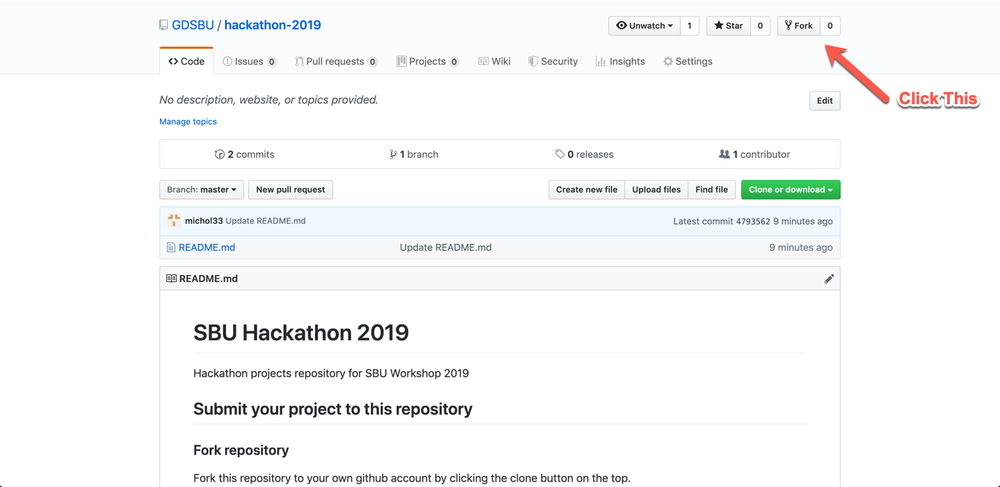

# SBU Hackathon 2019
Hackathon projects repository for SBU Workshop 2019

## Submit your project to this repository


### Fork repository
Fork this repository to your own github account by clicking the clone button on the top.



### Clone repository

Clone this repository onto a local directory by running this following command:
```
git clone https://github.com/<YOUR GITHUB USERNAME>/hackathon-2019.git
```

### Upload your project to your forked github repository

Add, commit and push with the following command:
```
git add <your project name>

git commit -m "<your commit message>"

git push 
```

### Submit a pull request to the main mmtf-hackathon-2018 repository

Click on the pull request tab on your forked mmtf-hackathon-2018 repository:


Add new pull request:


Compare changes:


Create pull request:

